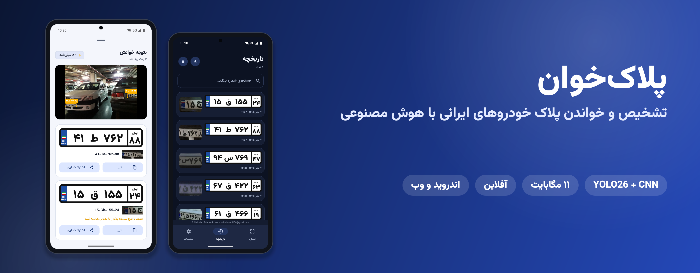
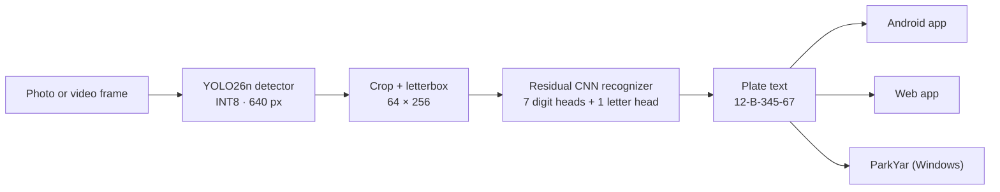
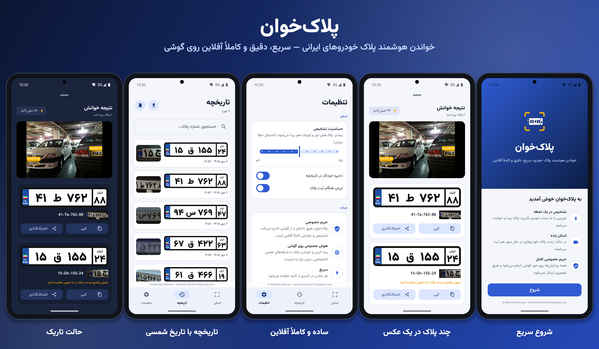

<p align="center"></p>

<h1 align="center">Persian Plate Recognition</h1>

<p align="center">
  Detects and reads Iranian licence plates end to end. The project covers training and evaluation, then ships as
  an offline Android app, a Persian web app and a Windows parking-management system.
</p>

<p align="center">
  <a href="https://github.com/Mehrdadrahmani/persian-plate-recognition/releases/download/v2.2.0/PlateReader-2.2.0-android.apk"></a>
  &nbsp;
  <a href="https://github.com/Mehrdadrahmani/persian-plate-recognition/releases/download/v2.2.0/ParkYar-1.1.0-windows-x64-setup.exe"></a>
</p>

<p align="center">
  
  
  
  
  
</p>

<p align="center"><a href="README.fa.md">فارسی</a> · <a href="docs/TECHNICAL_REPORT.md">Technical report</a> · <a href="parkyar/">ParkYar</a> · <a href="https://github.com/Mehrdadrahmani/persian-plate-recognition/releases">All releases</a></p>

---

## Overview

The system works in two stages, followed by a set of deployment targets:

1. **Detection:** a fine-tuned YOLO26n model finds every plate in a photo or video frame.
2. **Recognition:** a residual CNN, trained from scratch, reads the plate's eight characters: two digits, a letter,
   three digits and a two-digit region code.
3. **Deployment:** both models are exported to ONNX and quantised to INT8, 11 MB in total. The same pipeline then runs
   in Python, on Android phones and on Windows PCs, without an internet connection.



| Product | Platform | Summary |
|---|---|---|
| **Plate Reader** (پلاک‌خوان) | Android 8.0+ | Camera, gallery and live scanning, plate history with Jalali dates, CSV export, dark mode; fully offline |
| **ParkYar** (پارک‌یار) | Windows 10 / 11 | Parking management: automatic entry and exit logging, fee calculation, receipts, dashboard, reports, subscribers |
| **Web app** | Any browser (Python) | Persian right-to-left Gradio interface with upload, webcam, batch processing and CSV export |

<p align="center"></p>

## Results

All figures come from the held-out **test** split, which was never used for training or model selection.

| Stage | Model | Test result |
|---|---|---|
| Detection | YOLO26n, 960 px | **mAP50 0.988**, mAP50-95 0.785 |
| Recognition | Residual CNN (from scratch) | **94.2 %** of plates fully correct, 98.9 % of characters correct |
| Recognition (baseline) | MobileNetV3-Large (fine-tuned) | 86.4 % of plates fully correct |
| End to end | Detector + recogniser | **969 / 1,091 plates read exactly (88.8 %)**, F1 0.894, CER 1.5 %, ~66 ms per image (Apple M1) |
| Mobile | INT8, 640 px detector | 959 / 1,091 plates, F1 0.900: **2.6× faster** and 11 MB instead of 40 MB |

The full methodology is in the [technical report](docs/TECHNICAL_REPORT.md). It covers data analysis, leakage-safe splits,
architectures, training curves, error analysis and the quantisation study.

## Download

| | Package | Requirements |
|---|---|---|
| Android app | [**PlateReader-2.2.0-android.apk**](https://github.com/Mehrdadrahmani/persian-plate-recognition/releases/download/v2.2.0/PlateReader-2.2.0-android.apk) | Android 8.0 or newer, arm64 or armv7 |
| ParkYar (10 free recognitions) | [**ParkYar-1.1.0-windows-x64-setup.exe**](https://github.com/Mehrdadrahmani/persian-plate-recognition/releases/download/v2.2.0/ParkYar-1.1.0-windows-x64-setup.exe) | Windows 10 or 11, 64-bit |

* **Android:** open the APK on the phone and allow installation from this source when prompted.
* **Windows:** the installer is not code-signed. If SmartScreen appears, choose *More info → Run anyway*.
* **Changes:** release notes are in the [Releases](https://github.com/Mehrdadrahmani/persian-plate-recognition/releases) section and in the [changelog](CHANGELOG.md).

## Licensing and pricing

* **Plate Reader (Android)** is free.
* **ParkYar (Windows)** includes 10 free plate recognitions so you can evaluate it.
  * For unlimited use, send the computer ID shown in the app's activation window to
    [mehrdad.rahmani100@gmail.com](mailto:mehrdad.rahmani100@gmail.com).
  * You will receive an activation key for that computer.
* For commercial licensing, custom deployments or support, contact the author.

## Quick start (Python)

```bash
git clone https://github.com/Mehrdadrahmani/persian-plate-recognition.git
cd persian-plate-recognition
python -m venv .venv && source .venv/bin/activate      # Python 3.10+
pip install -r requirements.txt
```

The trained models are included in `models/`, so no training is required.

```bash
python scripts/predict.py car.jpg                       # ۱۲ ب ۳۴۵ - ۶۷  (12-B-345-67)
python scripts/predict.py photos/*.jpg --json --save-vis out/
python webapp/app.py                                       # Persian web app on http://127.0.0.1:7860
```

```python
from platereader.pipeline import PlateRecognizer

reader = PlateRecognizer("models", backend="onnx")
for plate in reader.predict("car.jpg"):
    print(plate.persian, plate.latin, plate.box)
```

## Reproducing the results

The datasets are not part of the repository. The download script fetches them: 6,252 annotated photos for detection
and 24,561 plate crops for recognition.

| Step | Command | Output |
|---|---|---|
| Download data | `python scripts/00_download_data.py` | `data/LPD`, `data/LPR` |
| Data checks, EDA, splits | `python scripts/01_prepare_data.py` | `reports/data/`, `work/splits/` |
| Train the detector | `python scripts/02_train_detector.py` | `work/runs/lpd/` |
| Train the recognisers | `python scripts/03_train_recognizer.py --arch both` | `work/runs/lpr/` |
| Evaluate (train / val / test) | `python scripts/04_evaluate.py` | `reports/evaluation/` |
| Export the model bundle | `python scripts/05_export_bundle.py --force` | `models/` (TorchScript + ONNX) |
| End-to-end evaluation | `python scripts/06_evaluate_end_to_end.py` | `reports/end_to_end/` |
| Mobile optimisation (INT8) | `python scripts/07_optimize_mobile.py` | `models/mobile/`, `reports/mobile/` |

* Training requires a CUDA GPU. The published models were trained on Kaggle (2× T4) with
  [`notebooks/training.ipynb`](notebooks/training.ipynb). The executed copy, with all outputs, is
  in the same folder.
* Every script accepts `--smoke` for a quick functional check on a few images.
* All hyperparameters are in [`configs/default.yaml`](configs/default.yaml).

## Method

**Data and splits.**
* Labels are normalised to a single format: 2 digits, then a letter (22 classes, with «الف» as one token), then
  3 digits and a 2-digit region code.
* Photos of the same vehicle are kept in the same split. The detection split is 70 / 15 / 15.
* The recognition split is stratified by letter.
* Every plate that appears in a detection test photo is forced into the recognition test set. The end-to-end
  evaluation therefore never sees a plate the recogniser was trained on.

**Detector.**
* YOLO26n, pretrained on COCO, fine-tuned for 40 epochs at 960 px with the MuSGD optimiser.
* The median plate is only 42 px tall, which is why the input resolution is high.

**Recogniser.**
* A four-stage residual CNN takes a 64×256 letterboxed crop.
* The last stage uses stride (2, 1), which keeps a 4×32 left-to-right feature map.
* A shared head (1×1 convolution, column pooling, then a fully connected layer with LayerNorm and dropout) feeds seven
  digit classifiers and one letter classifier.
* Training: label smoothing, class-weighted letters, AdamW with OneCycle, gradient clipping, and gradient-health
  monitoring.

**Pipeline.**
* Detection runs at a 0.65 confidence threshold, the value with the best end-to-end F1 in the threshold sweep.
* Each box is enlarged by 5 %, cropped, letterboxed and passed to the recogniser.

**Errors.**
* Missed detections are mostly very small plates (under 25 px tall).
* Recognition errors are mostly a single wrong digit on blurred, dark or tilted crops.
* Some reported false positives are genuine plates that the annotators missed.

<p align="center">
  
  
</p>

## Android app

[`android/`](android/) is a Gradle project with two modules:

* **`core`** is pure Kotlin/JVM. It holds the image processing and ONNX Runtime inference, ported line by line from
  the Python reference, including exact re-implementations of Pillow's antialiased bilinear resize and OpenCV's
  bilinear resize. Parity tests on real test data confirm it matches Python:
  * the letterbox is bit-exact;
  * 200 of 200 plate crops give the same text;
  * all 47 plates on 40 test photos are found, and 46 of them give the same text.
* **`app`** is the user interface: Kotlin with Material 3, right-to-left Persian in the Vazirmatn typeface, CameraX,
  live scanning with two-frame confirmation, history with Jalali dates and CSV export, and dark mode.

```bash
cd android
./gradlew :core:test              # parity tests (needs models/ and data/)
./gradlew :app:assembleRelease    # app/build/outputs/apk/release/
```

The build needs JDK 17+ and the Android SDK (platform 35, build-tools 35.0.1). Google's Maven repository is used, with
a mirror as fallback for regions where Google's Android downloads are blocked.

## ParkYar: parking management for Windows

[ParkYar](parkyar/) turns the recogniser into a complete product for car parks:
* Entry and exit cameras log every vehicle automatically.
* When a car leaves, ParkYar calculates the stay and the fee from a configurable tariff and prints a receipt.
* It also offers a live dashboard, reports with Excel export, subscriber management, and manual correction of any read.

<p align="center"></p>

See the [ParkYar documentation](parkyar/README.md) for features, installation and development.

## Repository structure

```
src/platereader/   Python package: data, training, evaluation, export, end-to-end pipeline
scripts/           numbered pipeline steps (00–07) and predict.py
configs/           default.yaml with every setting
models/            trained detector and recognisers (PyTorch, TorchScript, ONNX, INT8) and data splits
reports/           figures, CSV tables and logs for every stage
notebooks/         Kaggle training notebook (clean and executed), end-to-end evaluation notebook
webapp/            Persian web app (Gradio)
android/           Android app (core inference module + app)
parkyar/           ParkYar parking-management desktop app
docs/              technical report and images
tests/             unit and integration tests (pytest)
```

## License

Released under the [GNU AGPL-3.0](LICENSE). The detector was trained with Ultralytics YOLO (AGPL-3.0), so the licence
also covers the trained weights. The datasets were provided for the course and are not redistributed. The Vazirmatn
typeface is licensed under the SIL Open Font License.

<p align="center"><sub>Developed by <a href="https://github.com/Mehrdadrahmani">Mehrdad Rahmani</a> · Rahnema College, 2026</sub></p>
