# Iranian Licence Plate Detection and Recognition — Technical Report

*Mehrdad Rahmani · 2026 · YOLO26 detection · CNN recognition · end-to-end evaluation · on-device deployment*

All numbers in this report come from files in `reports/` and `models/` that were produced by the code in this
repository; every figure referenced below is stored under `reports/`. Unless stated otherwise, results are on the
**held-out test split**, which was never used for training, early stopping or model choice. Operating thresholds are
chosen on the validation split; the test-set threshold sweep in Section 5 is reported for analysis only.

---

## 1. Task and overview

The system reads Iranian licence plates from ordinary photos in two stages:

1. **Detection (LPD):** find every plate in a photo (Ultralytics YOLO26).
2. **Recognition (LPR):** read the 8 characters of a cropped plate (pure PyTorch; two architectures compared).
3. **End to end:** photo → boxes → padded crops → plate strings, evaluated on the held-out test photos.
4. **Deployment:** INT8 models in an offline Android app, a Persian web app and a Windows parking-management system.

| stage | model | test result |
|---|---|---|
| detection | YOLO26n @ 960 px | mAP50 **0.988**, mAP50-95 0.785, P 0.957, R 0.976 |
| recognition | residual CNN from scratch | full-plate accuracy **94.2 %**, per-character 98.9 % |
| recognition (comparison) | MobileNetV3-Large fine-tuned | full-plate 86.4 %, per-character 97.0 % |
| end to end | detector + scratch CNN | **969 / 1 091 plates read exactly (88.8 %)**, F1 0.894, CER 1.5 % |
| mobile (Android) | INT8 640 px detector + INT8 CNN | 959 / 1 091 (F1 0.900), 2.6× faster, 11 MB instead of 40 MB |

---

## 2. Data

### 2.1 LPD – detection dataset
* 6 252 photos (mostly 1280×960 / 960×1280), **YOLO-format labels** (`0 cx cy w h`), one class, 7 257 plates
  (87 % of photos have one plate, up to 9).
* `plate_labels.csv` also gives the **plate text** of every plate (several plates space-separated); the number of
  strings matches the number of boxes in all 6 252 photos, and all 7 257 strings parse as a valid plate.
* Automatic checks (broken images, missing/empty/malformed labels, out-of-range boxes) found **no problems**;
  boxes overshooting the image by < 1 % are clipped.
* Plates are **small**: median 136×42 px at native resolution, 5 % below 12 px high → the detector is trained at
  960 px instead of the usual 640.

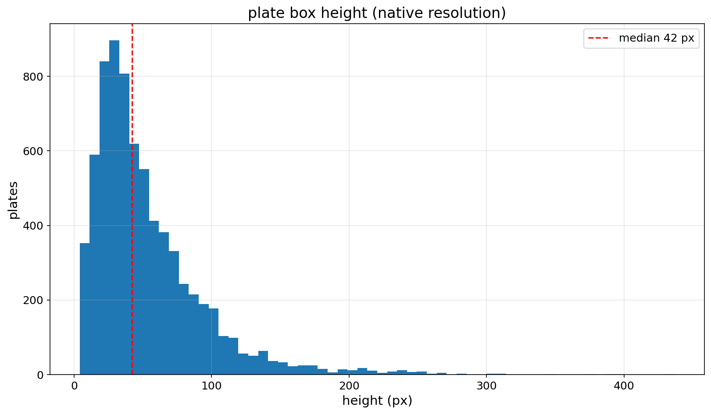
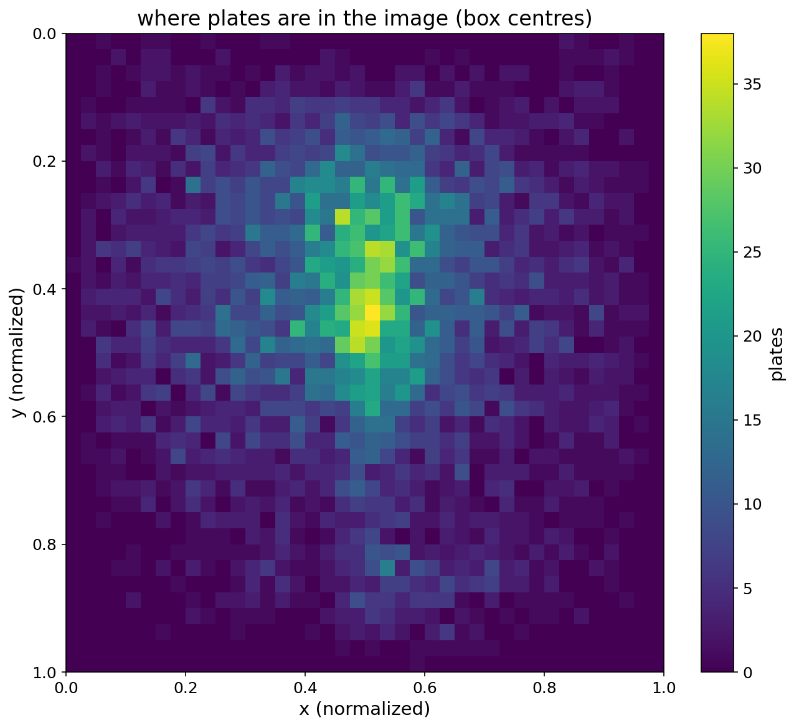

### 2.2 LPR – recognition dataset
* 24 561 cropped plates (RGB, 37–3 592 px wide, median aspect w/h 3.45) with labels in `valid_samples.csv`.
* Label normalisation (found by inspection):
  * 997 labels contain a zero-width joiner after «ه» (a rendering artefact) → removed;
  * 45 labels spell the letter *alef* as «الف» (3 code points) → treated as **one** letter token.
  After this every label is **2 digits + letter + 3 digits + 2-digit region code** (the task's "7 digits + 1
  letter"); **22 letter classes**, strongly imbalanced («د» 2 267 crops … «ز», «پ» 1 crop each).
* Finding from the test results: the 21 crops labelled «آ» are red government plates showing «الف» — probably
  mislabelled; both models read them as «الف».

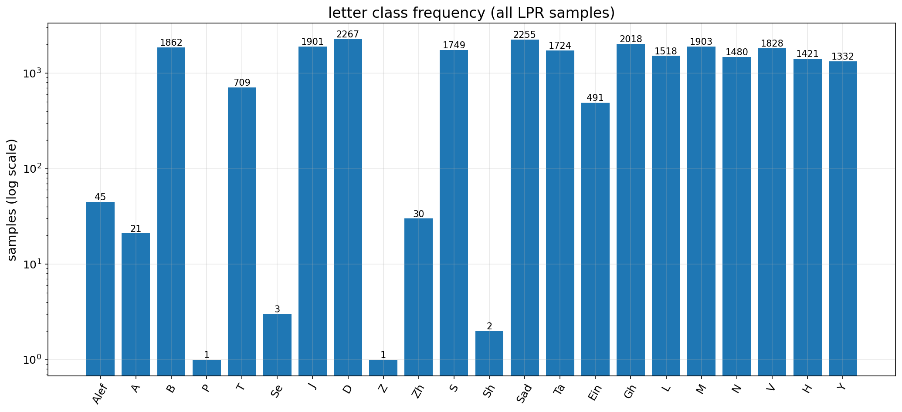

### 2.3 Splits (no leakage)
* **LPD:** 70 / 15 / 15 % with seed 42. Photos sharing a plate string (the same car) are grouped with union-find
  so a vehicle never appears in two splits (5 917 groups → 4 376 / 938 / 938 photos).
* **LPR:** grouped by plate string (20 906 unique plates), stratified by letter, 80 / 10 / 10 of the remaining
  groups. **Every LPR plate that appears in an LPD test photo is forced into the LPR test split** (927 plates,
  1 211 crops), because the LPR crops were cut from the same photos — otherwise the end-to-end evaluation would read
  plates the recognizer had trained on. Result: 18 671 / 2 340 / 3 550 crops.
* The split code is deterministic; `scripts/01_prepare_data.py` recreates exactly the split of the shipped models
  (verified: identical file lists).

---

## 3. Detection

**Model:** YOLO26n (Ultralytics 8.4, NMS-free head, no DFL), COCO-pretrained, 2.4 M parameters.

| setting | value | why |
|---|---|---|
| image size | 960 | small plates |
| epochs / patience | 40 / 15 | best mAP50-95 at epoch 37 |
| batch | 16 per GPU, DDP on 2 × T4 (32) | Kaggle T4 x2 |
| optimizer | MuSGD, lr0 0.01, cosine schedule | YOLO26 default (set explicitly: `auto` switches to AdamW below 10k iterations) |
| augmentation | mosaic (off for the last 10 epochs), HSV, translate 0.1, scale 0.5, flip 0.5 | Ultralytics defaults |

Training took 0.98 h. Losses (box, cls, L1) decrease smoothly for train and val; validation mAP rises and
plateaus without over-fitting.

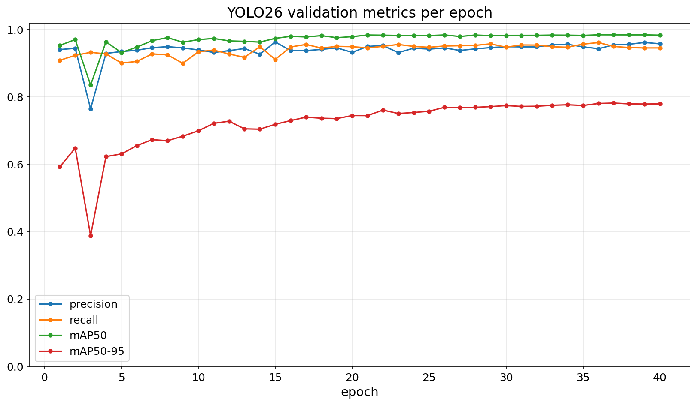
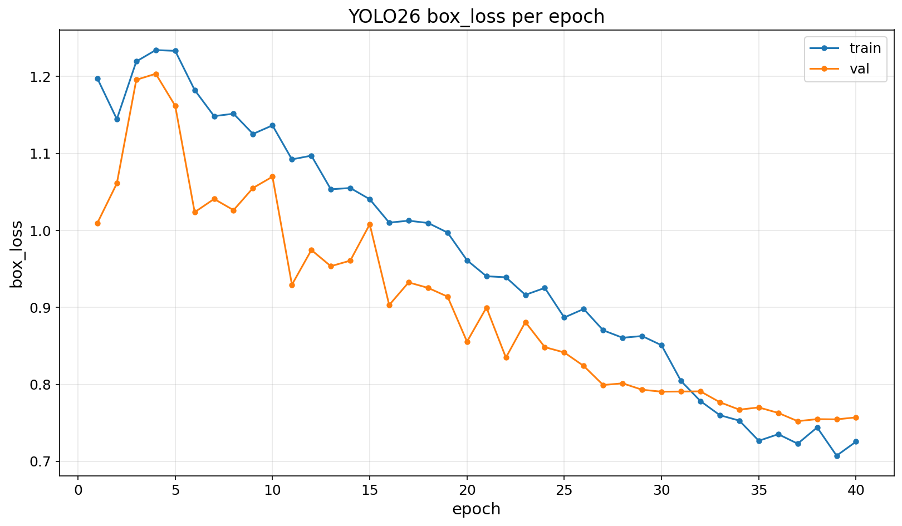

**Results (Ultralytics val, IoU 0.5 / 0.5–0.95):**

| split | images | precision | recall | mAP50 | mAP50-95 |
|---|---|---|---|---|---|
| train | 4 376 | 0.969 | 0.980 | 0.992 | 0.820 |
| val | 938 | 0.955 | 0.950 | 0.985 | 0.784 |
| **test** | 938 | **0.957** | **0.976** | **0.988** | **0.785** |

Train − test mAP50 = 0.4 points → no over-fitting. The F1-optimal confidence on val is 0.618.

**Error analysis (test):** recall by plate height — 0.74 (< 15 px), 0.91 (15–25 px), ≈ 0.98 above. The hardest
images are distant cars in parking lots and on highways; several "false positives" are real plates the annotators
missed (e.g. cut-off plates at the image border).

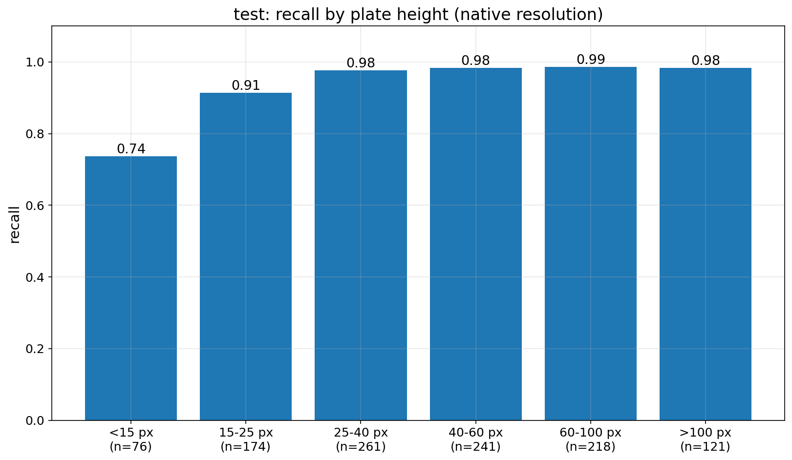
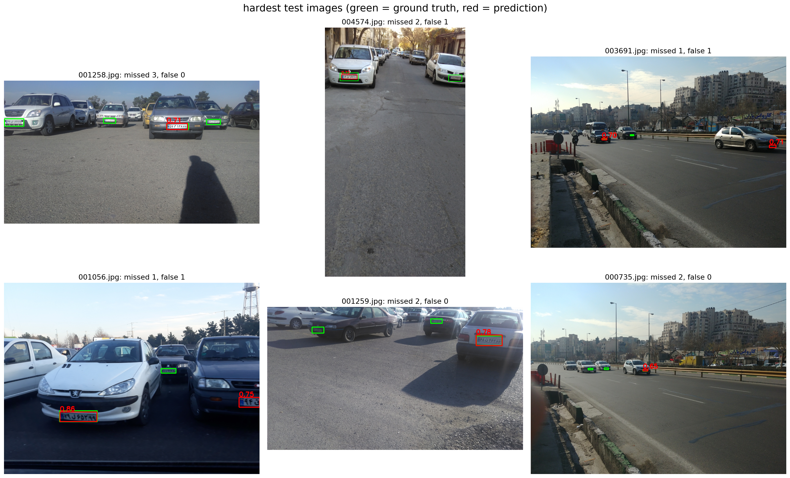

---

## 4. Recognition

### 4.1 Input and augmentation
* Crops are **letterboxed to 64 × 256** (keep aspect, grey padding 114, never stretched), RGB, ImageNet
  normalisation (both models share one preprocessing function, shipped as `recognizer.py`).
* Training-only augmentation: random crop/pad ±8 % per side (imitates imperfect YOLO boxes), small affine
  (±4°, shear, scale 0.9–1.05), colour jitter, Gaussian blur, 10 % grayscale. **No horizontal flip.**

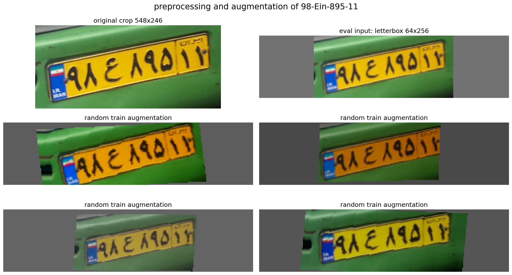

### 4.2 Architectures
Both models share the **multi-head output** `LPRHead`: 1×1 conv → BN → ReLU → adaptive average pooling to a row
of columns (keeps the left-to-right order of characters) → flatten → Dropout → FC 512 → **LayerNorm** → ReLU →
Dropout → **7 independent digit classifiers** (one 10-way head per slot) + **1 letter classifier** (22-way).
Independent per-slot heads were chosen because the flattened features are not aligned per character; each slot
learns to read its own region, and the letter gets its own vocabulary and loss weighting.

* **Model I — ScratchLPRNet (7.4 M params):** stem conv 3→32, four residual stages (64, 128, 256, 256 channels;
  two basic blocks each, BN, ReLU, skip connections with 1×1 projections), Dropout2d in stages 3–4. The last stage
  has stride (2, 1), so the 64×256 input ends as a 4×32 feature map; the head pools to 16 columns.
  Initialisation: Kaiming-normal (fan-out, ReLU) for all convs and the hidden FC, BN γ=1 β=0, the last BN of every
  residual branch γ=0 (each block starts as identity), output heads N(0, 0.01).
* **Model II — MobileNetV3-Large (4.3 M params):** torchvision `features` with `IMAGENET1K_V2` weights (stride 32 →
  960×2×8 map) + the same head (8 columns). **Two-stage fine-tuning:** 3 epochs with the backbone frozen (BN kept
  in eval mode), then all layers with parameter groups (backbone LR 3e-4, head LR 1e-3).

### 4.3 Training setup (shared loop)
| | Model I | Model II |
|---|---|---|
| optimizer | AdamW (no decay on biases / norms), weight decay 0.05 | AdamW, weight decay 0.01 |
| schedule | OneCycle, max LR 2e-3, 15 % warm-up | OneCycle per stage |
| epochs (early-stopping patience) | 40 (8) | 3 + 25 (6) |
| batch | 128 | 128 |
| loss | mean of the 8 per-slot cross-entropies; label smoothing 0.05; letter class weights ∝ (1/freq)^0.5, capped at 5 | same |
| other | gradient clipping 5, AMP fp16 on CUDA, checkpoint + resume every epoch | same |

Early stopping and model selection use **validation full-plate accuracy** (all 8 characters correct).

### 4.4 Monitoring and gradient health
Every 10 steps the loop logs the global gradient norm (before clipping), per-layer norms of representative layers
(first / middle / last backbone conv, head FC, letter head), the fraction of zero ReLU outputs and the fraction of
over-confident letter predictions (softmax > 0.99).

| | Model I | Model II |
|---|---|---|
| global grad norm (median / p99 / max) | 0.259 / 1.07 / 1.69 | 0.614 / 1.87 / 2.49 |
| non-finite steps, clipped steps | 0, 0 % | 0, 0 % |
| smallest / largest layer grad ratio | 5.1e-2 | 2.5e-1 |
| zero-activation fraction | 0.43–0.51 (head reduce 0.77) | 0.16–0.56 |

→ **no exploding gradients** (norms stay in a narrow band, never reach the clip value), **no vanishing gradients**
(the first conv layer receives gradients within 1–2 orders of magnitude of the head), **no dead or saturated units**
(ReLU zero fractions around 0.5, no layer near 1; label smoothing keeps softmax outputs from saturating).

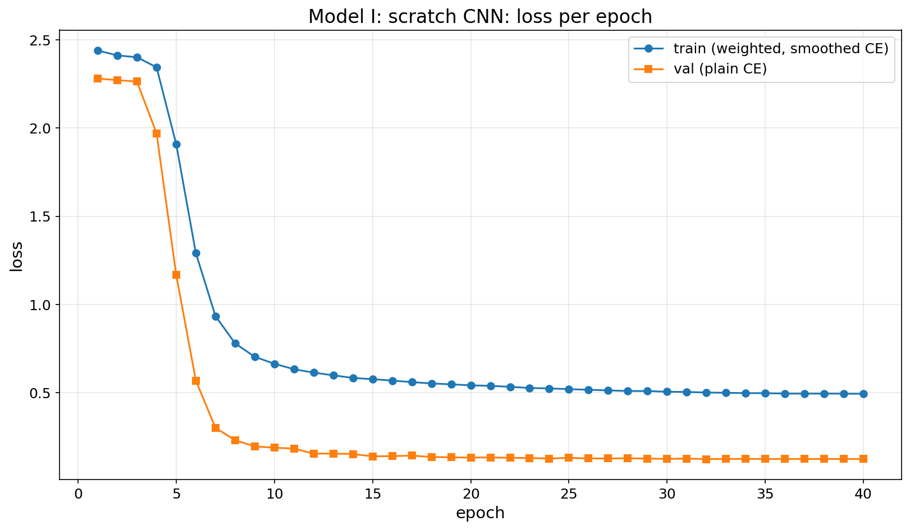
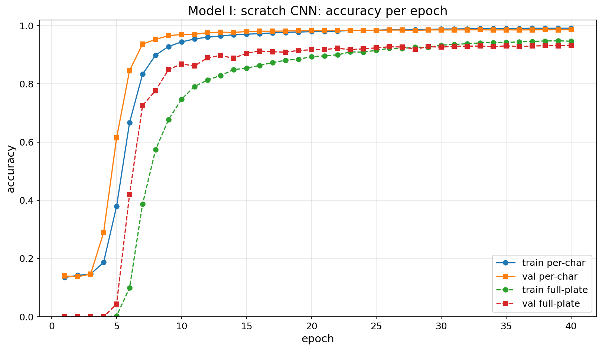
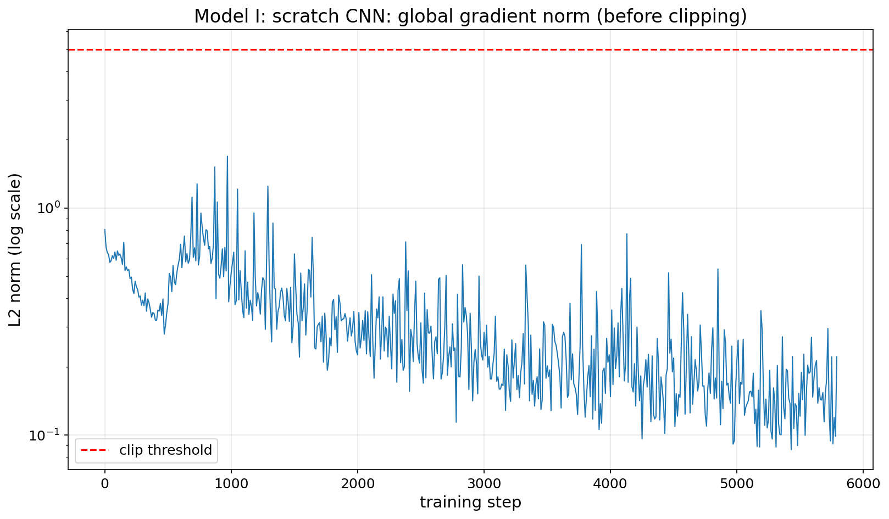
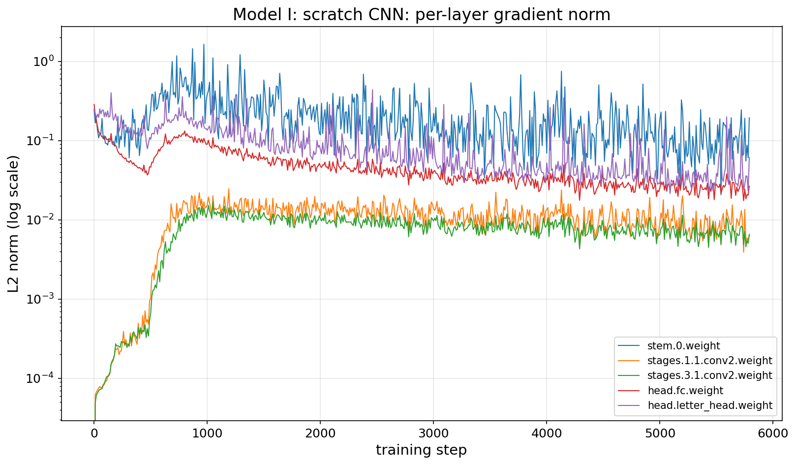
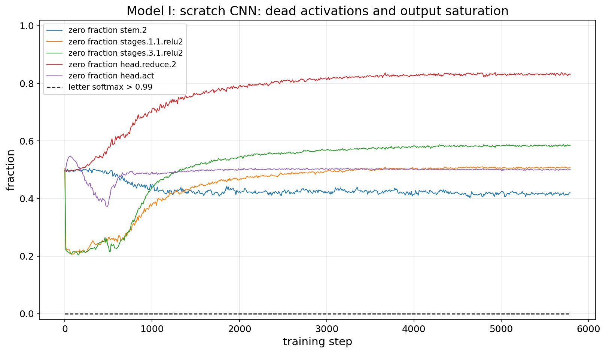

### 4.5 Results

| split | Model I plate acc | Model I char acc | Model II plate acc | Model II char acc |
|---|---|---|---|---|
| train (no augmentation) | 0.981 | 0.997 | 0.922 | 0.986 |
| val | 0.932 | 0.986 | 0.858 | 0.967 |
| **test** | **0.942** | **0.989** | **0.864** | **0.970** |

| (test) | Model I (scratch) | Model II (MobileNetV3) |
|---|---|---|
| full-plate accuracy | **0.942** | 0.864 |
| per-character accuracy | **0.989** | 0.970 |
| letter accuracy | 0.988 | 0.975 |
| macro F1 digits / letters | 0.989 / 0.894 | 0.971 / 0.892 |
| test loss (plain CE) | **0.111** | 0.162 |
| parameters | 7.40 M | 4.32 M |
| checkpoint size | 28.3 MB | 16.7 MB |
| latency, T4 GPU, 1 image / batch 64 | 3.4 ms / 57 ms | 7.3 ms / 15 ms |
| latency, CPU, 1 image / batch 64 | 30.8 ms / 2 437 ms | 15.0 ms / 350 ms |

**Model I is chosen** (highest test full-plate accuracy). Its train–test gap is 3.9 points (generalises well); it
was still improving at the last epoch, so longer training would probably help a little. Model II is weaker even
on its training data, most likely because MobileNetV3's stride-32 output (2×8) is too coarse to separate 8
characters; its advantage is speed on batches and on CPU. Most Model I errors are a single digit on blurry, dark,
tilted or tiny crops (accuracy 79 % below 25 px crop height versus ≈ 96 % above). The rare letters («آ», «ژ»,
«الف») lower the letter macro F1.

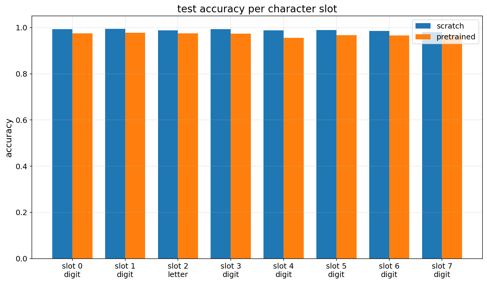
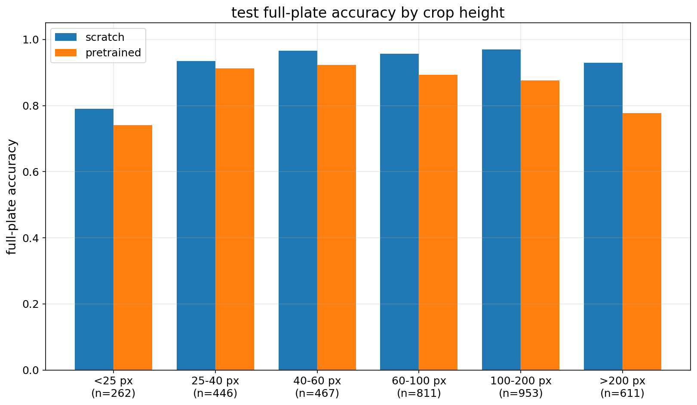
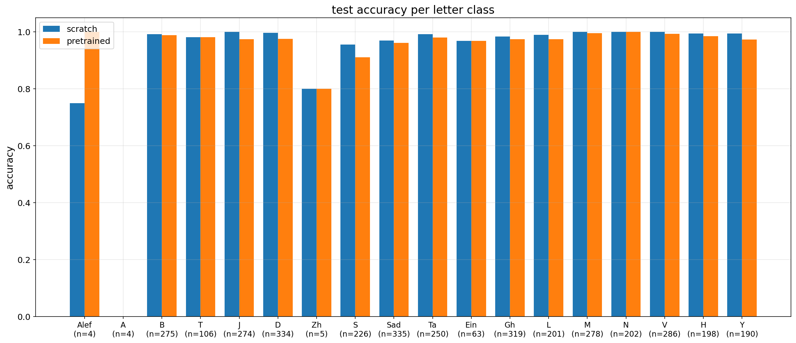
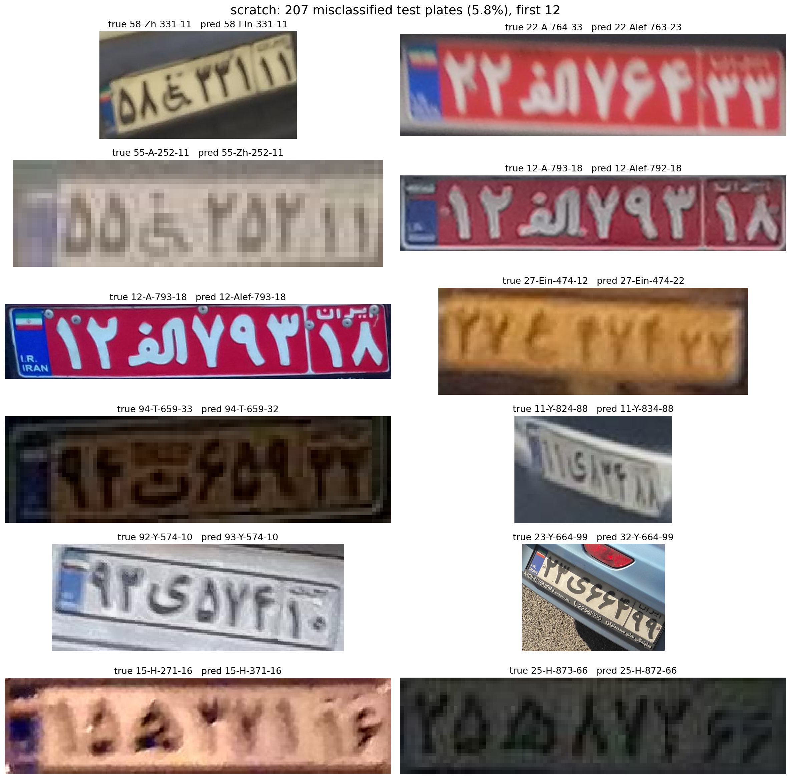

---

## 5. End-to-end system

**Pipeline** (`src/platereader/pipeline.py`, class `PlateRecognizer`): YOLO26 detection → every box enlarged by 5 %
per side → letterbox 64×256 → Model I → plate string + reading confidence (the lowest of the 8 character
probabilities). Two interchangeable back ends: PyTorch (Ultralytics + TorchScript) and ONNX Runtime (numpy pre-
and post-processing; the reference for the Android port).

**Evaluation protocol** (`src/platereader/e2e_eval.py`, run by `scripts/06_evaluate_end_to_end.py`):
the pipeline runs once per test photo at a low threshold and every detection is cached, so any threshold can be
scored. Detections are matched to ground-truth boxes at IoU ≥ 0.5; because `plate_labels.csv` does not say which
string belongs to which box, the matched predictions of a multi-plate photo are assigned to its strings by minimum
total edit distance (Hungarian). A plate counts as correct only if all 8 characters match.

| (938 test photos, 1 091 plates) | **threshold 0.618 (chosen on validation)** | threshold 0.65 (best test F1, for reference) |
|---|---|---|
| detection precision / recall | 0.959 / 0.959 | 0.961 / 0.948 |
| end-to-end precision / recall / F1 | 0.890 / 0.890 / 0.890 | **0.901 / 0.888 / 0.894** |
| plates read exactly | 971 | 969 |
| reading accuracy on detected plates | 0.928 | 0.937 |
| character error rate (detected plates) | 1.8 % | **1.5 %** |
| photos with every plate right and nothing extra | 85.6 % | 85.7 % |

Speed: 66 ms per photo on an Apple M1 (PyTorch MPS: 45 ms detection + 12 ms recognition).

Error breakdown (threshold 0.65): 969 read correctly, 39 with one wrong character, 26 with two or more,
57 not detected, 42 false boxes. The reading accuracy on detected plates (93.7 %) is close to Model I's accuracy on
isolated crops (94.2 %, Section 4) — cropping YOLO boxes costs almost nothing, thanks to the crop-jitter augmentation.

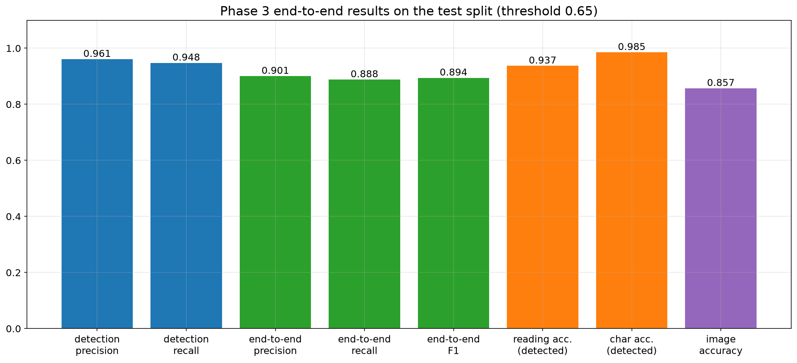
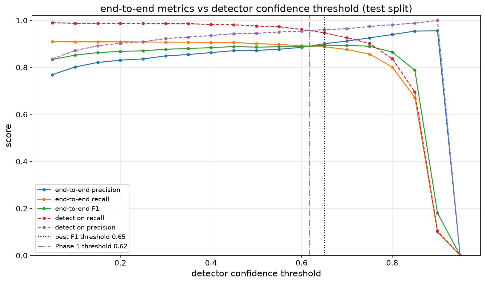
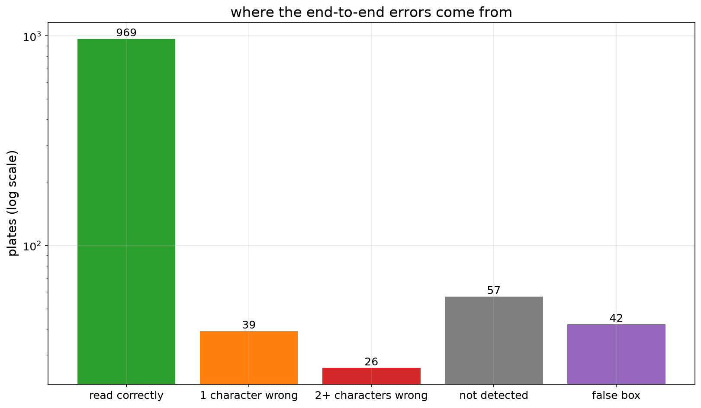
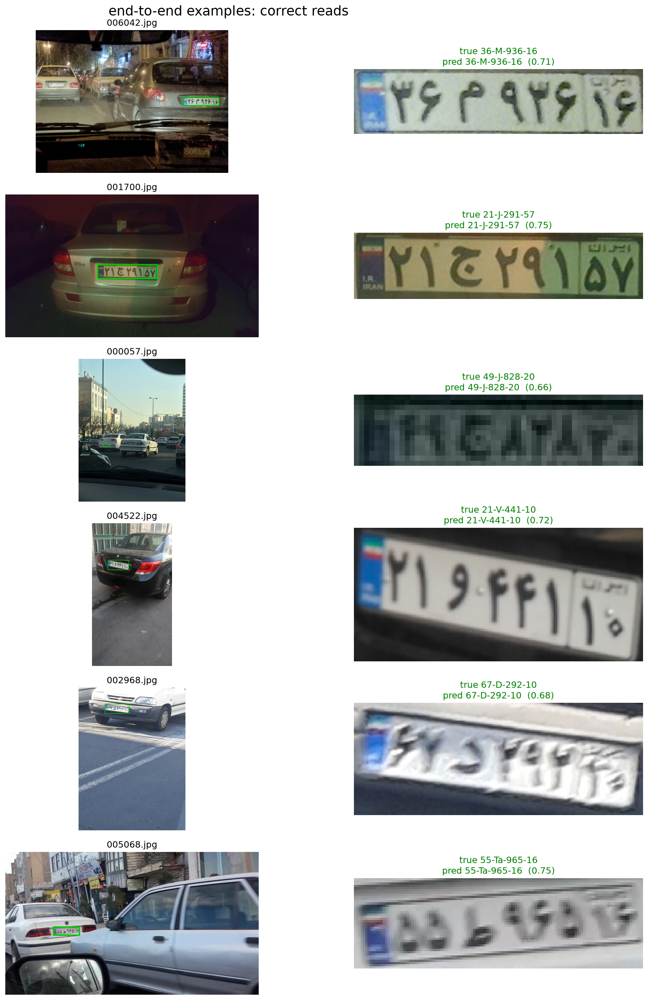
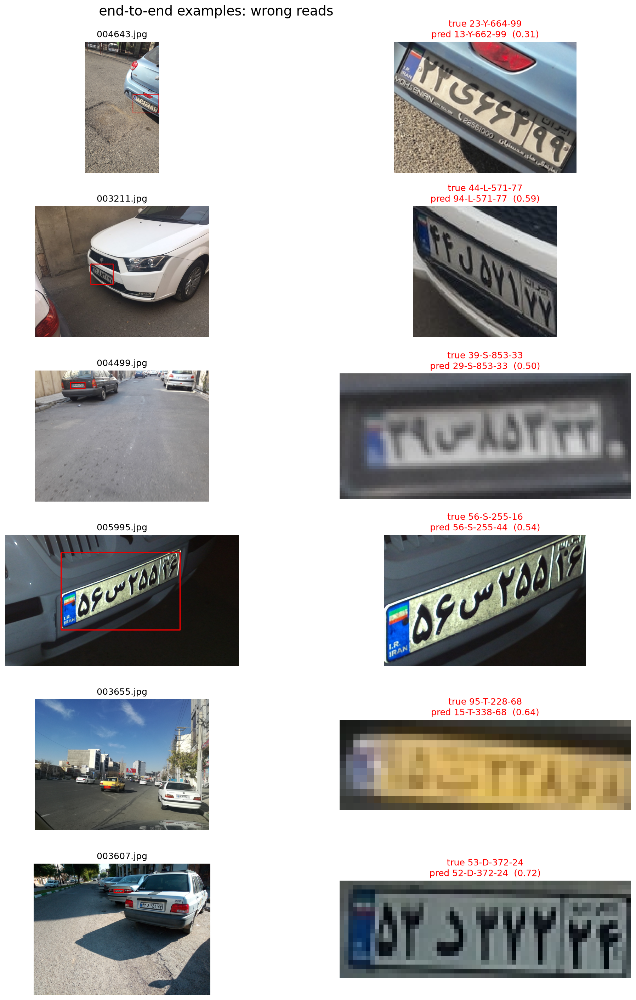

---

## 6. Deployment

### 6.1 Mobile models (`scripts/07_optimize_mobile.py`)
ONNX Runtime static INT8 quantisation (QDQ, per-channel weights, calibrated on training images) and a 640 px
detector were evaluated end to end. The choice was made **on the validation split only**, then reported on test:

| detector | recognizer | size (MB) | threshold (from val) | val F1 | test F1 | test plates read exactly | ms / image* |
|---|---|---|---|---|---|---|---|
| FP32 960 px (baseline) | FP32 | 39.6 | 0.70 | 0.917 | 0.895 | 954 / 1 091 | 394 |
| INT8 960 px, fully quantised | FP32 | 32.8 | – | 0 | 0 | 0 | – |
| INT8 960 px, head FP32 | FP32 | 33.2 | 0.70 | 0.919 | 0.891 | 953 | 287 |
| FP32 640 px | FP32 | 39.4 | 0.60 | 0.919 | 0.900 | 957 | 255 |
| INT8 640 px, head FP32 | FP32 | 33.0 | 0.55 | 0.922 | 0.901 | 960 | 204 |
| INT8 960 px, head FP32 | INT8 | 11.1 | 0.70 | 0.919 | 0.889 | 950 | 230 |
| **INT8 640 px, head FP32 (shipped)** | **INT8** | **10.9** | **0.55** | **0.923** | **0.900** | **959** | **149** |

\* Apple M1 Pro CPU with macOS Low Power Mode on, so only the ratios matter (2.6× faster than the baseline).
On the Android emulator (arm64, 4 cores) the shipped app reads a 1280×960 photo in about **0.1 s** after warm-up,
against 2.5 s for the first app version (FP32 960 px) under the same conditions.

Findings: fully quantising the detector breaks it (0 detections) — the detection head and the Softmax operations
must stay in FP32; the INT8 recognizer loses only 0.09 points (0.9408 vs 0.9417 on all 3 550 test crops) while being
3× faster and 4× smaller; the 640 px detector is slightly *better* end to end than 960 px at the F1-optimal
threshold and much faster.

### 6.2 Applications
* **Persian web app** (`webapp/app.py`, Gradio): right-to-left UI in the Vazirmatn font, Iranian-style plate cards,
  upload / webcam / paste, batch processing with CSV export, history, an About page with the test metrics.
* **Android app** (`android/`, Kotlin + ONNX Runtime, fully offline): camera and gallery input, **live scanning**
  (boxes over the camera preview, each plate confirmed after two frames), result sheet with copy / share, history
  with Jalali dates, search and CSV export, settings, dark mode. The inference code lives in a plain Kotlin module
  (`core`) that re-implements Pillow's and OpenCV's resize arithmetic exactly; unit tests compare it with the Python
  pipeline on real test data (letterbox bit-exact, 200/200 crops identical, 46/47 end-to-end plates identical).
* **ParkYar** (`parkyar/`, PySide6 + ONNX Runtime): Windows parking management with entry and exit cameras,
  two-frame plate confirmation, automatic stay and fee calculation, receipts, a dashboard, reports and subscribers.

---

## 7. Conclusions and future work
* The two-stage design works well: a small YOLO26 finds 97.6 % of test plates, and a compact residual CNN trained
  from scratch reads 94 % of crops perfectly — better than a fine-tuned MobileNetV3 in this setting.
* End to end, 88.8 % of all test plates are read exactly (90.3 % with the mobile models); remaining errors are
  mostly tiny or blurry plates and one-digit confusions, which the reading confidence flags.
* Next steps: relabel the «آ» samples as «الف»; train the recognizer longer; train the detector at higher
  resolution or with tiling for very small plates; give MobileNetV3 a finer feature map (larger input or smaller
  last stride); collect more rare-letter plates.

---

## Appendix — reproduce
```bash
python scripts/00_download_data.py && python scripts/01_prepare_data.py
python scripts/02_train_detector.py && python scripts/03_train_recognizer.py --arch both   # CUDA GPU
python scripts/04_evaluate.py && python scripts/06_evaluate_end_to_end.py && python scripts/07_optimize_mobile.py
```
The published models were trained on Kaggle (2× T4) with `notebooks/training.ipynb`; the executed copy with all
outputs is `notebooks/training_executed.ipynb`.
