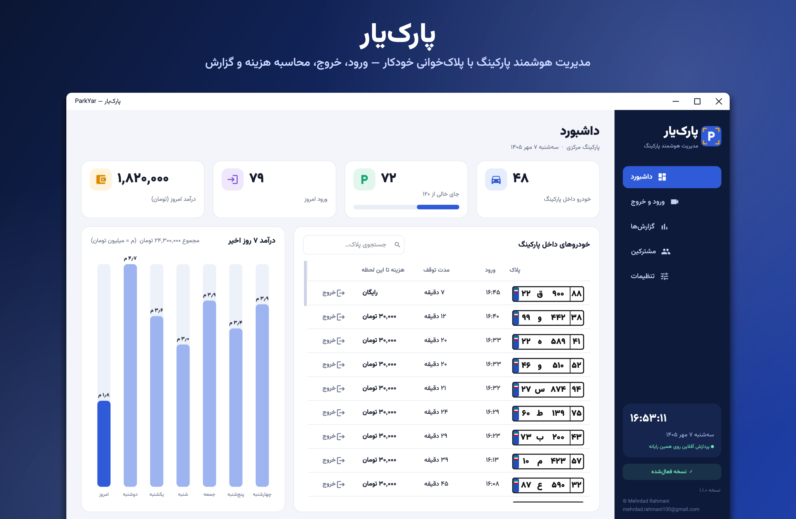
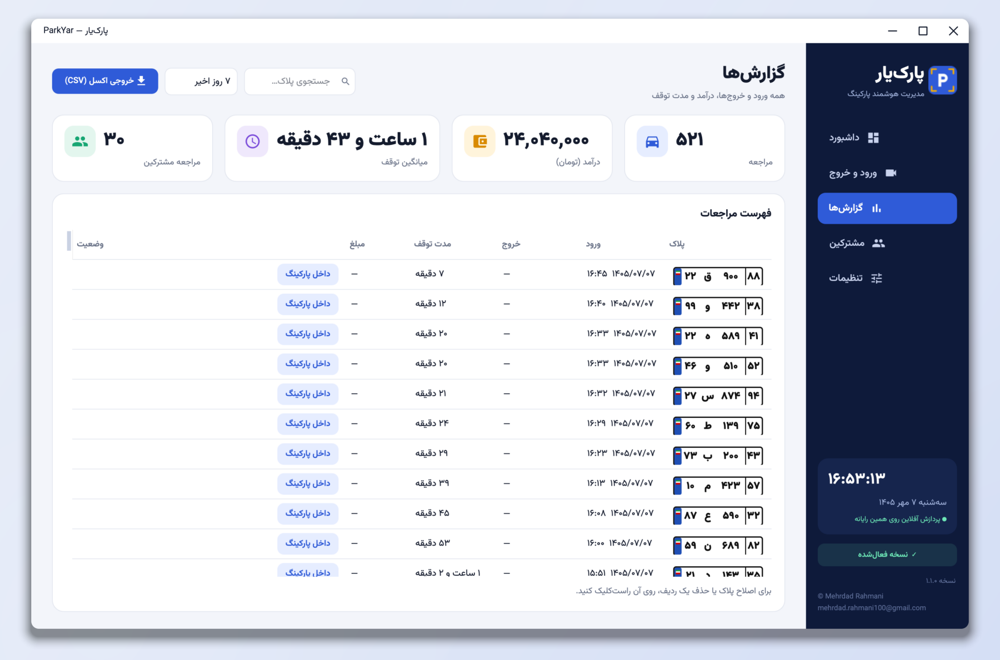
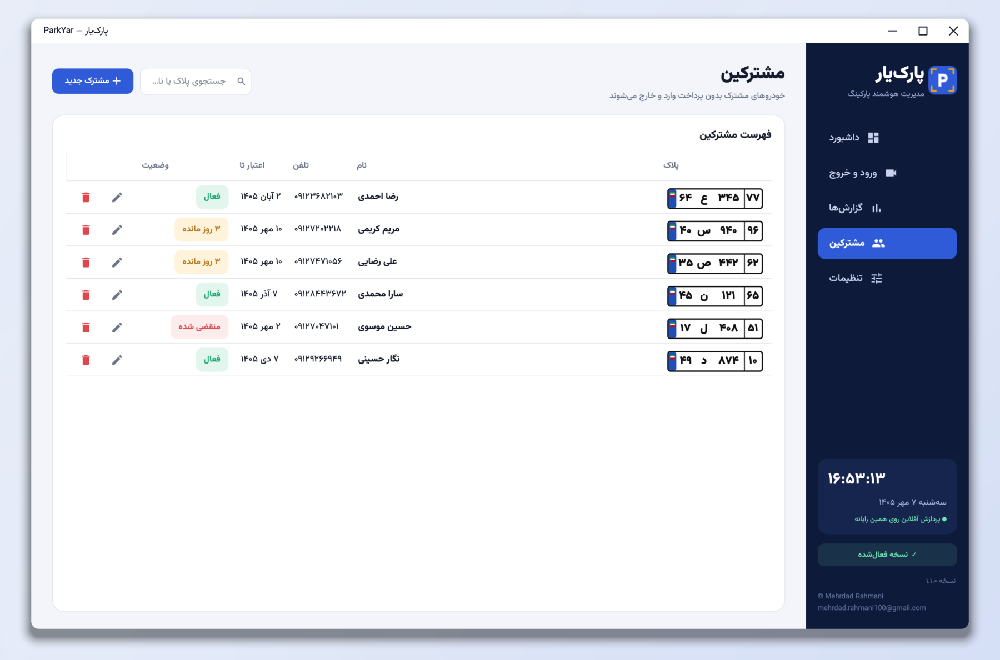
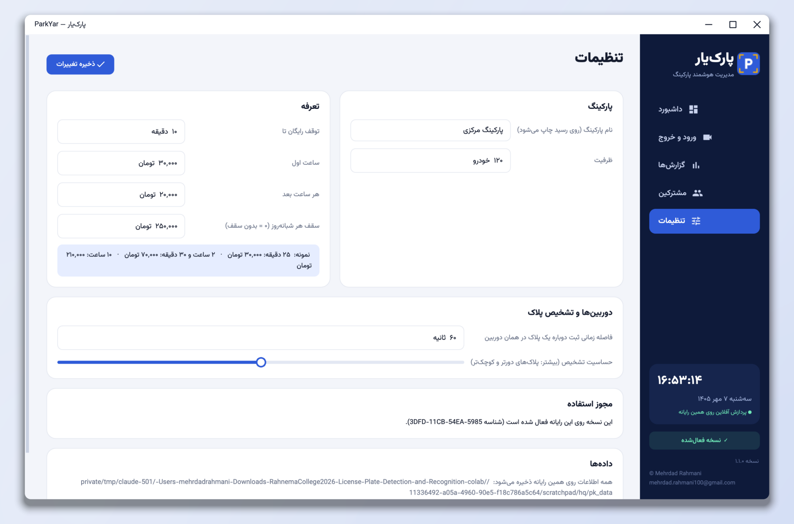

<p align="center"></p>

<h1 align="center">ParkYar · پارک‌یار</h1>

<p align="center">
  Parking management for Windows with automatic Iranian licence-plate recognition.<br>
  Entry and exit logging, fee calculation, receipts and reporting, all running offline on the gate PC.
</p>

<p align="center">
  <a href="https://github.com/Mehrdadrahmani/persian-plate-recognition/releases/download/v2.2.0/ParkYar-1.1.0-windows-x64-setup.exe"></a>
</p>

<p align="center"><a href="README.fa.md">فارسی</a> · <a href="../README.md">Main project</a> · <a href="https://github.com/Mehrdadrahmani/persian-plate-recognition/releases">Releases</a></p>

---

## Why ParkYar

Many car parks still record plates and times by hand. That is slow at the gate, prone to mistakes, and leaves no
reliable record. ParkYar handles the whole process:
* Cameras at the entry and the exit read each plate as the vehicle arrives and leaves.
* The system logs the stay and calculates the fee from the car park's tariff.
* The operator only confirms the payment and hands over a receipt.

<p align="center"></p>

## Features

**Automatic gates**
* Works with USB webcams and IP cameras (RTSP); video files and photos can be used for demonstrations.
* A plate is logged only after two consistent readings. A cool-down period prevents duplicate entries for the same
  vehicle.
* A single misread character is matched to the correct vehicle automatically. When no entry exists, the operator
  chooses from similar plates currently inside or corrects the number.

**Billing**
* Configurable tariff: a free grace period, a first-hour rate, a rate for each additional started hour, and a daily cap.
* The checkout screen shows the entry time, exit time, duration and amount due, with a printable receipt.
* Subscribers (monthly members) park free until their subscription expires.

**Management**
* A live dashboard shows occupancy, free spaces, today's entries and revenue, and a seven-day revenue chart.
* Reports can be filtered by period and plate and exported to Excel (CSV, UTF-8). Individual entries can be corrected.
* Manual entry and exit, a Jalali calendar, Persian digits throughout, and one-click database backup.

| Reports | Subscribers | Settings |
|---|---|---|
|  |  |  |

## Free trial and activation

* ParkYar includes **10 free plate recognitions**. Manual entries and exits are not counted.
* To activate unlimited use, open *Activation* from the sidebar or Settings. Send the computer ID shown there to
  [mehrdad.rahmani100@gmail.com](mailto:mehrdad.rahmani100@gmail.com), then paste the activation key you receive.
* Each key works only on the computer it was issued for.

## Installation

### Windows 10 / 11 (64-bit)

1. Download [**ParkYar-1.1.0-windows-x64-setup.exe**](https://github.com/Mehrdadrahmani/persian-plate-recognition/releases/download/v2.2.0/ParkYar-1.1.0-windows-x64-setup.exe).
2. Run the installer. It adds shortcuts to the Start menu and the desktop. Python is not required.
3. The installer is not code-signed. If Windows SmartScreen appears, select *More info → Run anyway*.

### From source (Windows, macOS, Linux)

```bash
git clone https://github.com/Mehrdadrahmani/persian-plate-recognition.git
cd persian-plate-recognition/parkyar
pip install -r requirements.txt
python -m parkyar            # production database
python -m parkyar --demo     # separate database with a week of sample data
```

Data is stored in `%APPDATA%\ParkYar` on Windows, `~/Library/Application Support/ParkYar` on macOS and
`~/.local/share/ParkYar` on Linux. Use `--data <folder>` to store it elsewhere.

## Deployment recommendations

* Mount each camera so the plate is at least about 100 px wide in the image and is not blurred by motion.
* Use an i5-class (or better) processor; recognition takes about 40 ms per frame on a modern laptop CPU.
* Make regular backups from *Settings → Backup*.

## Technology

The recognition engine comes from the [main project](../README.md) in this repository:
* **Detection:** YOLO26n with a 640 px input, quantised to INT8.
* **Recognition:** a residual CNN trained from scratch that reads all eight characters from a 64×256 crop, also INT8.
* **Tracking:** a two-frame confirmation filter that suppresses spurious reads.

The two models total 11 MB and run on the CPU with ONNX Runtime. The pre-processing reproduces the training pipeline
exactly, and the app gives the same plate text as the reference implementation on the test photos.

| Component | Technology |
|---|---|
| User interface | Qt 6 (PySide6), right-to-left Persian, Vazirmatn typeface |
| Inference | ONNX Runtime (CPU), NumPy, OpenCV, Pillow |
| Storage | SQLite |
| Packaging | Embedded Python and an NSIS installer (pynsist) |

```
parkyar/
  app.py        main window and controller (entry, exit and checkout logic)
  engine.py     plate detector and recogniser
  camera.py     camera thread and two-frame tracker
  billing.py    tariff and fee calculation
  db.py         sessions, subscribers and settings (SQLite)
  pages.py      dashboard, gates, reports, subscribers, settings
  dialogs.py    checkout and receipt, plate entry, subscriber editor
  widgets.py    Iranian plate widget, camera view, charts
  jalali.py     Jalali calendar, Persian durations and currency
tools/build_windows.py   builds the Windows installer (also works on macOS and Linux)
```

## Development

```bash
pip install -r requirements.txt pytest
pytest                                                  # plates, calendar, billing, database, tracker, engine
QT_QPA_PLATFORM=offscreen python -m parkyar --selftest  # opens every page and runs the models
```

**Building the installer:**
1. Install pynsist (`pip install pynsist`) and NSIS (`brew install makensis` on macOS).
2. Run `python tools/build_windows.py`. The installer is written to `dist/`.

**Continuous integration:** a GitHub Actions workflow runs the tests on Windows, builds the installer, installs it
silently and self-tests the installed application.

## License

[GNU AGPL-3.0](../LICENSE). The Vazirmatn typeface is licensed under the SIL Open Font License.

<p align="center"><sub>Developed by <a href="https://github.com/Mehrdadrahmani">Mehrdad Rahmani</a></sub></p>
